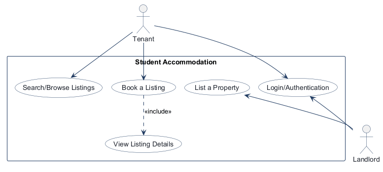
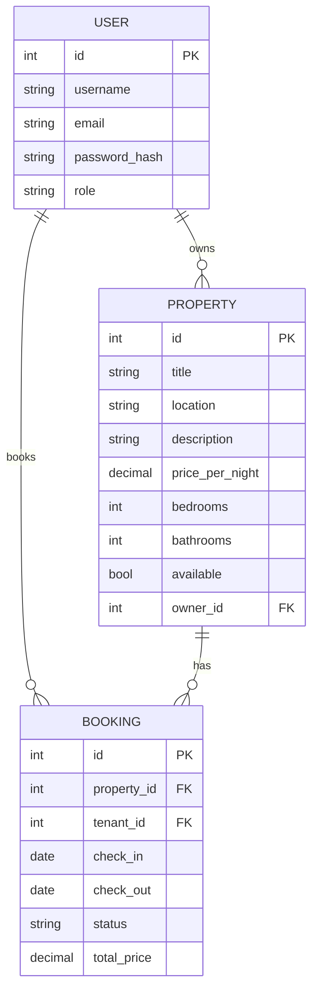

# COMP 3613 Assignment 1

Draft this file with the Guide. **Update it after every phase milestone** before you pause. The use-case diagram is a UML PNG at `docs/diagrams/use-case.png`, linked from this file as `diagrams/use-case.png` (path relative to `docs/report.md`). The model diagram is Mermaid. **Embed wireframe images** as `wireframes/<file>` (files live in `docs/wireframes/`).

Do not put your student ID in this file if you will commit it. The PDF cover adds your name and ID at export time.

## Assigned project
Student Accommodation

## Three workflows

### 1. Search/Browse Listings (Tenant)

### 2. List a Property (Landlord)

### 3. Book a Listing (Tenant)

## Use case diagram

[Use-case diagram source](diagrams/use-case.json).

Tenant and Landlord share Login/Authentication; a signed-in session is required
for all three named workflows. Search/Browse Listings and Book a Listing belong
to Tenant, while List a Property belongs to Landlord. Book a Listing includes
View Listing Details, which is a separate use case and must happen before a
booking. No other use cases are shared.

## Model diagram

The app model is centered on users, properties, and bookings. A landlord owns many property listings, and each property can have many bookings. A tenant makes many bookings, and each booking is tied to one property and one tenant.

## Wireframes

The updated combined wireframe labels the two parts of each named workflow, includes the spelling correction, and shows login as the shared entry point before protected workflows. The same image covers search/browse listings, listing a property, and booking a listing.

### Student Accommodation Wireframe

<!-- student-build:wireframe-coverage
use_case: Login/Authentication (Tenant and Landlord)
image: docs/wireframes/Wireframe design.png
covered: yes
-->

<!-- student-build:wireframe-coverage
use_case: Search/Browse Listings (Tenant)
image: docs/wireframes/Wireframe design.png
covered: yes
-->

<!-- student-build:wireframe-coverage
use_case: List a Property (Landlord)
image: docs/wireframes/Wireframe design.png
covered: yes
-->

<!-- student-build:wireframe-coverage
use_case: Book a Listing (Tenant)
image: docs/wireframes/Wireframe design.png
covered: yes
-->

`python manage.py report` also embeds any PNG/JPG still missing from `docs/wireframes/`.

## Theming

Phase 5 theme direction: CampusStay uses a clean, minimal white background, dark gray text, light gray borders, rounded corners, and generous whitespace. Coral-red (#FF385C) is reserved for primary buttons and key actions. A monochrome CampusStay logo and sticky role-aware top navigation are shared across pages; tenants get browse/bookings links and landlords get listings/add-property links.

## Implementation notes

Implemented the Phase 5 accommodation app as a layered FastAPI build:

- Login/Authentication: `/login` authenticates users and directs tenants to `/app` and landlords to `/admin`; `/register` creates accounts.
- Search/Browse Listings: the tenant dashboard at `/app` filters listings by location and max nightly price and displays listing cards for browsing.
- View Listing Details: listing cards open `/properties/{property_id}`, where tenants can review realistic studio listings around UWI-area streets and finalise a stay before booking. Demo apartments are focused around UWI St. Augustine and nearby residential streets such as Watts, Evans, Rapsey, Lyndon, Old Tim, and Carmody Road.
- List a Property: the landlord dashboard at `/admin` and the `/properties/new` form support property creation; both creation routes require the landlord/admin dependency and use a service/repository layer rather than route-level SQL.
- Book a Listing: the detail page includes a booking form that calculates the nightly total and submits a booking record through the booking service layer. Booking validation rejects past dates, invalid checkout dates, and any overlapping stay for the same property.

The app was verified with the seeded users `bob / bobpass`, `alice / alicepass`, and `admin / adminpass`, and the property listing, booking validation, and booking submission flow were exercised successfully against the live server.

## Deployed app

Phase 6 is not yet deployed in this workspace. A public Render URL will be added after the final deployment step is completed.

https://

## Logins

Every account a marker needs, including extra users you added. Starter accounts:

- bob / bobpass — regular user
- alice — landlord (admin role); new databases seed `alicepass`, while existing Alice credentials are preserved
- admin / adminpass — admin

## YouTube URL

## Session transcripts

Filled when the Guide builds the report: the agent writes each Guide chat to `docs/transcripts/<slug>.md` (Copilot Agent, Cursor, or OpenCode). `python manage.py report` packages them. Do not paste chats here during the build.

## Competency (student-judge)

Filled when the report is built. Guide runs student-judge, writes `docs/judge.md`, and export appends the scorecard here.

## Skill integrity

Filled by `python manage.py report`. Do not edit the course skills.
